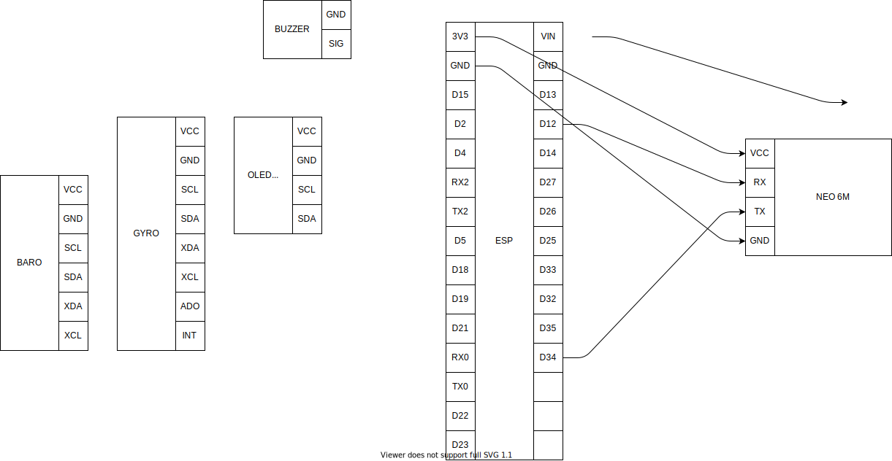

# IOT Vario #

## Tela ##

*rascunho da tela

## Esquemas ##

### ESP32, BMP280 e OLED SSD1306 ###

SDO: É necessário conectar SDO em GND para forçar o BMP280 usar a conexão I2C.

## Links ##

<https://github.com/LilyGO/TTGO-T-Beam>

<https://capsistema.com.br/index.php/2020/04/20/guia-do-uso-esp32-construa-uma-estacao-meteorologica-bmp280-ssd1306/>

<http://tlbenedetti.blogspot.com/2017/12/variometro-arduino-com-oled-e-bmp280.html>
