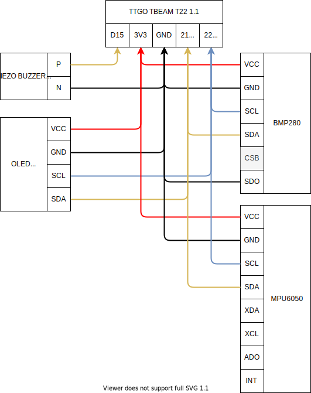

# IOT Vario #

## Descrição ##

Este é um projeto visa ser um computador de vôo para praticantes de parapente.

### Funcionalidades (Prontas e em desenvolvimento) ###

- Pronto:
  - Altitude (Barômetro)
  - Pressão (Barômetro)
  - Temperatura (Barômetro)
  - Temperatura do dispositivo (sensor onboard)
  - Altitude (GNSS)
  - Longitude (GNSS)
  - Latitude (GNSS)
  - Satelites (GNSS)
  - Variometro sonoro (ascendente e descendente)
  - Uso de baterias 18650 (3.6V)
  - Case feito em impressora 3D (Colocar o link aqui)
- Em desenvolvimento:
  - Padronização da interface gráfica do display OLED
  - Integração com xctrack (app android)
  - Gravação de dados em arquivo SD no formato IGC
- Em planejamento:
  - Integração do TBEAM com tela e-paper que já possui um esp32, provavelmente será com o protocolo ESP NOW.
  - Substituição da tela OLED por um display E-PAPER maior
  - Transmissão de dados via LORAWAN
  - Transmissão de dados via WIFI (internet)
  - Integração com what3words.com
- Quem sabe:
  - Integração com meshtastic
  - Sinal de socorro via LORAWAN
  - Envio de dados em tempo real com LORAWAN
  - Dispositivo servir como power bank

*GNSS = (GPS + GLONASS)

### Componentes ###

1x TTGO T-Beam T22 v1.1
1x Tela oled 128x64 (I2C)
1x Sensor de temperatura BMP280 (I2C)
1x Buzzer passivo de alta qualidade

## Planos de integração (futuro) ##

- MPU9250
  - Acelerômetro, Giroscópio e Magnetômetro
- Tela e-paper
  - Tela de baixo consumo usado em leitores de e-book

## Tela oled 0.96 ##

*rascunho da tela

## Esquemas ##

### ESP32 ###

SDO: É necessário conectar SDO em GND para forçar o BMP280 usar a conexão I2C.

### TTGO T-BEAM 1.1 ###

## Problemas frequentes ##

GPS não está funcionando.
    - A antena que acompanha o t-beam v1.1, retangular e pequena não funciona nem por decreto, então troque por uma quadrada grande, quando tiver mais detalhes coloco aqui.

## Links ##

<https://github.com/LilyGO/TTGO-T-Beam>

<https://capsistema.com.br/index.php/2020/04/20/guia-do-uso-esp32-construa-uma-estacao-meteorologica-bmp280-ssd1306/>

<http://tlbenedetti.blogspot.com/2017/12/variometro-arduino-com-oled-e-bmp280.html>

## Outros  ##

Não sou especialista em C ou C++, então o código não deve estar muito bom, contribuições nesse ponto (principalmente) são muito bem vindas.
